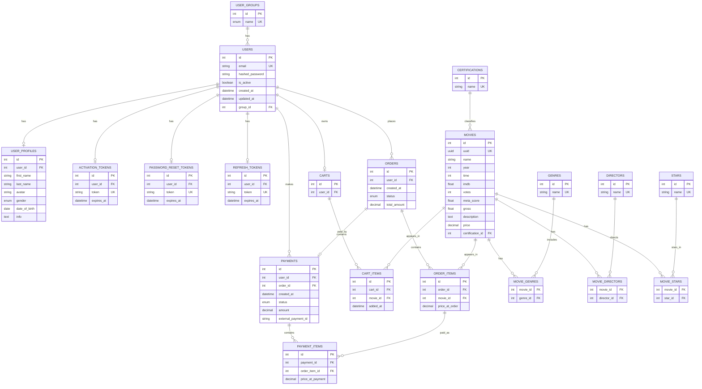

# Online Cinema API

A backend API for an online cinema platform built with FastAPI. It supports user authentication, movie management, carts, orders, and payments.

## Database Diagram



## Features

- **Authentication**: JWT-based auth with Argon2 password hashing.
- **Movies & Media**: Management of movies, genres, directors, stars, and certifications.
- **Shopping**: Cart management and order processing.
- **Payments**: Payment tracking system.
- **Background Tasks**: Celery and Celery Beat for scheduled tasks, such as cleaning expired activation tokens.
- **Database**: PostgreSQL with SQLAlchemy ORM and Alembic migrations.
- **Caching**: Redis for caching and as a broker for Celery.

## Tech Stack

- **Language**: [Python 3.12+](https://www.python.org/)
- **Framework**: [FastAPI](https://fastapi.tiangolo.com/)
- **ORM**: [SQLAlchemy 2.0](https://www.sqlalchemy.org/)
- **Migrations**: [Alembic](https://alembic.sqlalchemy.org/)
- **Task Queue**: [Celery](https://docs.celeryq.dev/)
- **Cache/Broker**: [Redis](https://redis.io/)
- **Database**: [PostgreSQL](https://www.postgresql.org/)
- **Package Manager**: [Poetry](https://python-poetry.org/)

## Requirements

- Docker and Docker Compose

## Setup & Run

1. Clone the repository.
2. Create a `.env` file from the example:
   ```bash
   cp .env.example .env
   ```
3. Update the values in `.env` if necessary.
4. Build and start the services:
   ```bash
   docker-compose up --build
   ```
   This will start:
   - `db`: PostgreSQL database
   - `redis`: Redis server
   - `fastapi`: The API server (auto-runs migrations)
   - `celery`: Celery worker
   - `celery-beat`: Celery beat for periodic tasks

The API will be available at `http://localhost:8000`. Documentation (Swagger UI) is available at `http://localhost:8000/docs`.

## Project Structure

```text
|-- alembic/              # Database migrations
|-- app/                  # Main application code
|   |-- auth/             # Authentication logic (routers, services, schemas)
|   |-- core/             # Configuration and security settings
|   |-- database/         # DB connection and session management
|   |-- models/           # SQLAlchemy models
|   |-- routers/          # API route handlers
|   |-- schemas/          # Pydantic schemas (data validation)
|   |-- services/         # Business logic layer
|   |-- worker/           # Celery application and tasks
|   |-- main.py           # FastAPI entry point
|   +-- seed.py           # Data seeding scripts
|-- tests/                # Automated tests (pytest)
|-- docker-compose.yml    # Docker services configuration
|-- Dockerfile            # Container definition
|-- pyproject.toml        # Poetry dependencies
+-- README.md             # This file
```

## Environment Variables

| Variable | Description | Default |
|----------|-------------|---------|
| `SECRET_KEY` | Secret key for JWT signing | `secret_key` |
| `ACCESS_TOKEN_EXPIRE_MINUTES` | Token expiration time | `30` |
| `REFRESH_TOKEN_EXPIRE_DAYS` | Refresh token expiration time in days | `7` |
| `DATABASE_URL` | SQLAlchemy database URL | - |
| `REDIS_URL` | Redis connection URL | - |
| `BASE_URL` | Base URL used for generated links | `http://localhost:8000` |
| `DB_USER` | PostgreSQL username used by Docker Compose | - |
| `DB_PASSWORD` | PostgreSQL password used by Docker Compose | - |
| `DB_NAME` | PostgreSQL database name used by Docker Compose | - |
| `SMTP_HOST` | SMTP server for emails | - |
| `SMTP_PORT` | SMTP server port | `587` |
| `SMTP_USER` | SMTP username | - |
| `SMTP_PASS` | SMTP password | - |
| `DEBUG` | Enable/disable debug mode | `False` |

Refer to `.env.example` for the full list of required variables.

## Scripts

- `docker-compose exec fastapi alembic upgrade head`: Apply all migrations manually.
- `app/seed.py`: Used to seed initial data (e.g., user groups). Note: it is currently called in `app/main.py` lifespan.
- `docker-compose exec celery celery -A app.worker.celery_app worker --loglevel=info`: Start Celery worker manually.

## Tests

Run tests inside the FastAPI container:

```bash
docker-compose exec fastapi pytest
```
